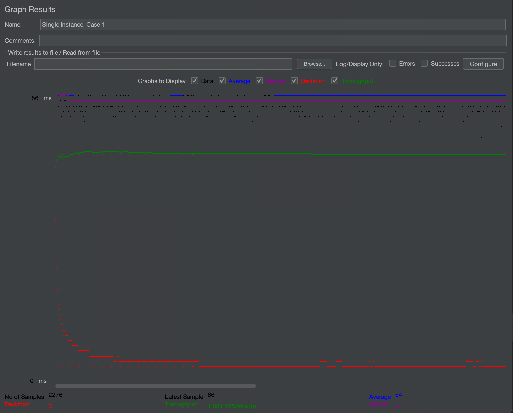
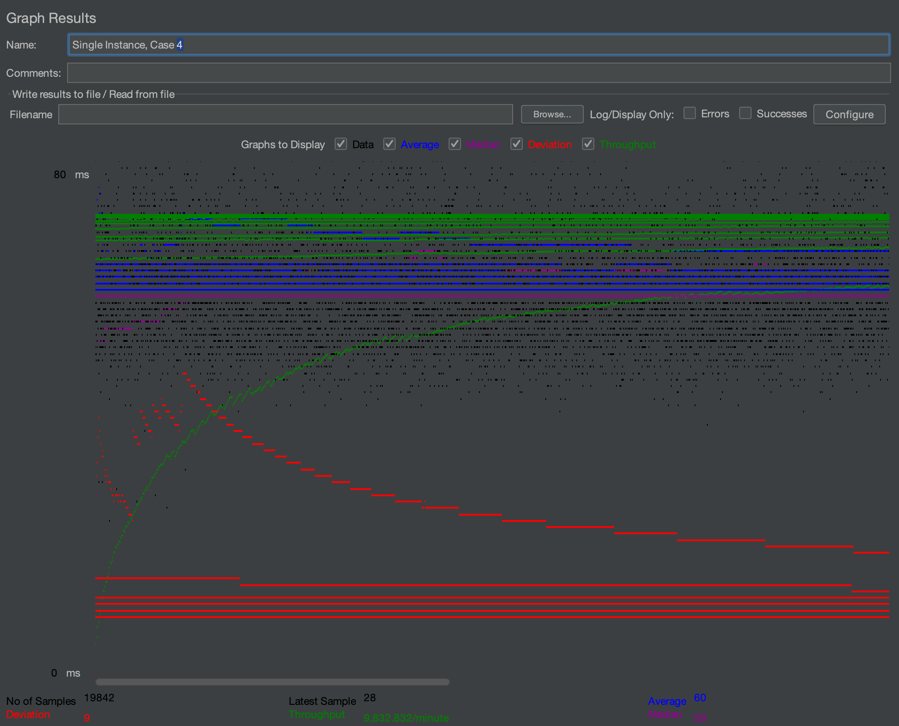
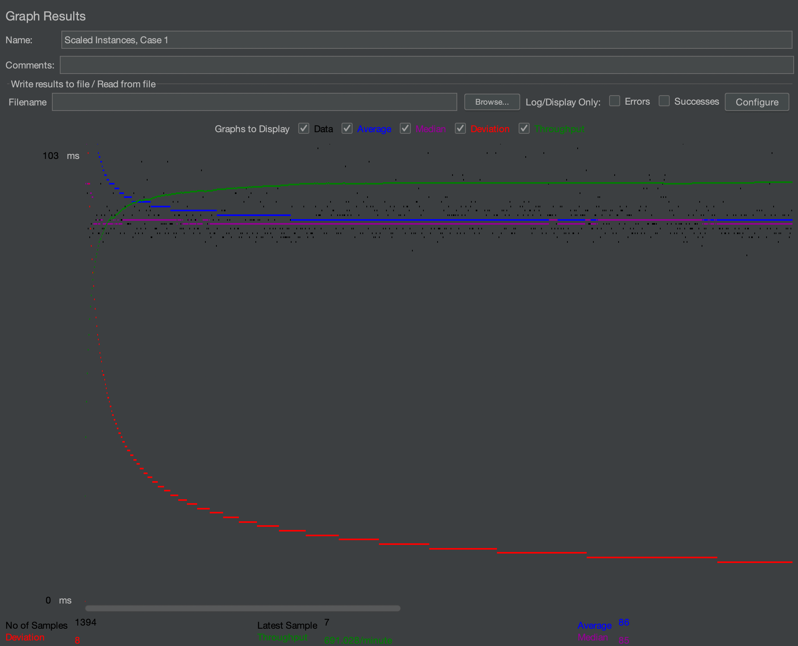
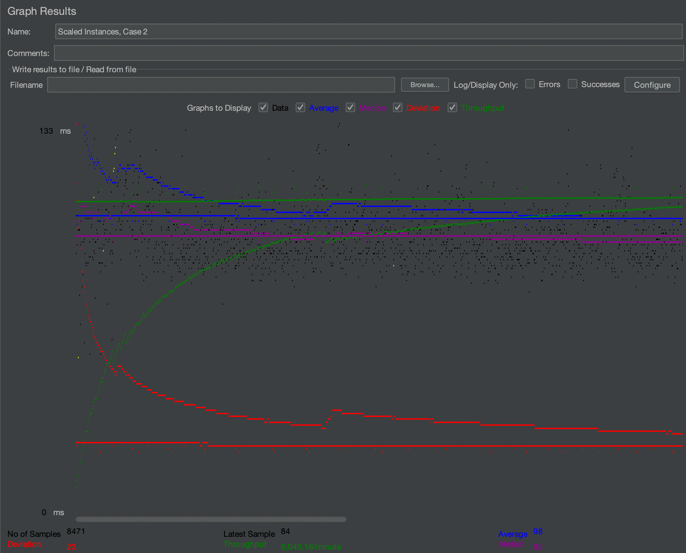
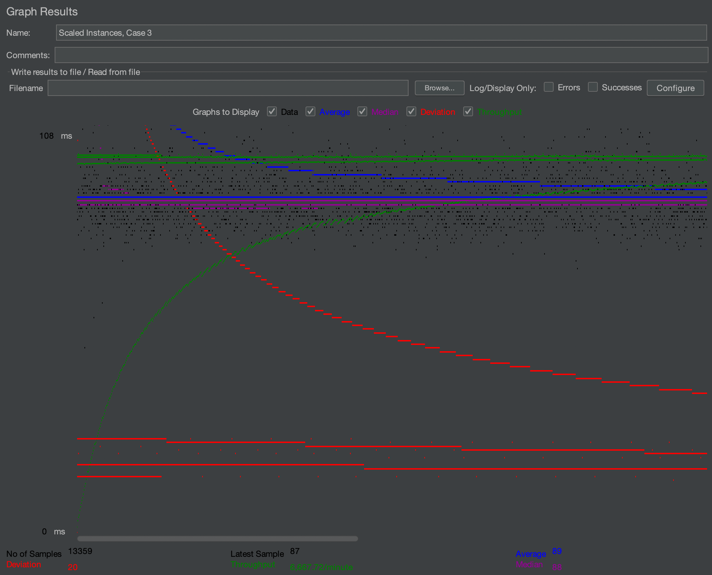

New Video 6/11: https://www.youtube.com/watch?v=uT1p8u-C_B0

- # General

  
 - #### Video Demo Link: https://www.youtube.com/watch?v=uT1p8u-C_B0

 - #### Instruction of deployment:
   - All 5(original,master,slave,aws loadbalancer, gcp load balancer) websites are deployed with links on Project 1 submission google doc.
   - To deploy this locally:  
     - Navigate to root directory
     - Run mvn clean
     - Run mvn package
     - Edit run configuration to use generated cs122b-project1-api-example.war file
     - Run tomcat on intellij

 - #### Collaborations and Work Distribution:
   I worked on this project on my own

- # Connection Pooling
 - #### Include the filename/path of all code/configuration files in GitHub of using JDBC Connection Pooling.
   /WebContent/META-INF/context.xml  
   /WebContent/WEB-INF/web.xml  
   /src/ResultsServlet.js  
   /src/* - All servlet files that query db use a data source with pooling

    - #### Explain how Connection Pooling is utilized in the Fabflix code.
  We initialize a data source from our MySQL server that uses connection pooling, which creates many connections for the server to use at its will, after which it returns the connection back to the pool. When we query the db using this data source, one connection is temporarily used to get the response from the MySQL server. Every Servlet file that queries the backend uses a data source with connection pooling.

    - #### Explain how Connection Pooling works with two backend SQL.
  Each SQL server will have its own pool of connections, and queries will be routed to one of the 2 backend servers.
  When one of those servers receive the request, they will pull a connection out of their pool, serve the request, and return the connection back to the pool.

   Sticky session: We need a way for the cluster of servers to recognize the cookies from users for subsequent requests.
   We implement this with sticky sessions, which associate a client and cookie with a the same server in the cluster. All requests
   from the client should go to the same instance in the cluster of servers. In this way, the cluster of servers can recognize a client's
   information from a session.

- # Master/Slave
 - #### Include the filename/path of all code/configuration files in GitHub of routing queries to Master/Slave SQL.
   WebContent/META-INF/context.xml
   

 - #### How read/write requests were routed to Master/Slave SQL?
   MySQLRouter sits as middleware between tomcat and mysql server. There are connections in the context file that use the MySQL router
   instead of connecting straight to the Database. Write requests are routed to the Master SQL database that's configured by the MySQL router.
   Read and write requests are sent to both the master and slave sql servers by the router.

- # JMeter TS/TJ Time Logs
- #### Instructions of how to use the `log_processing.*` script to process the JMeter logs.
  Type into console: python3 log_processing.py [NAME_OF_LOG_FILE #1]  

  for processing averages of only one file

-  Type into console: python3 log_processing.py [NAME_OF_LOG_FILE #1] [NAME_OF_LOG_FILE #2]  
  for processing averages of both master/slave text files

- # JMeter TS/TJ Time Measurement Report

- Note: I used the GCP server as the balancer for scaled tests as it was faster than the AWS balancer
- Note: Case #1 only needs one log file due to there being only 1 thread; all requests only go to one server due to sticky sessions

| **Single-instance Version Test Plan**          | **Graph Results Screenshot**     | **Average Query Time(ms)** | **Average Search Servlet Time(ms)** | **Average JDBC Time(ms)** | **Analysis**                                                              |
|------------------------------------------------|----------------------------------|----------------------------|-------------------------------------|---------------------------|---------------------------------------------------------------------------|
| Case 1: HTTP/1 thread                          |  | 56                         | 35                                  | 29                        | Fastest time due to only 1 thread being used                              |
| Case 2: HTTP/10 threads                        |  | 75                         | 85.358                              | 68.734                    | Avg query time is slower due to 10 threads                                |
| Case 3: HTTPS/10 threads                       |  | 89                         | 71                                  | 88                        | Slower due to HTTPS having a larger request/response complexity than HTTP |
| Case 4: HTTP/10 threads/No connection pooling  |  | 80ms                       | 75                                  | 69                        | No Connection Pooling made queries slower                                 |

| **Scaled Version Test Plan**                   | **Graph Results Screenshot**     | **Average Query Time(ms)** | **Average Search Servlet Time(ms)** | **Average JDBC Time(ms)** | **Analysis**                                                                                                           |
|------------------------------------------------|----------------------------------|----------------------------|-------------------------------------|---------------------------|------------------------------------------------------------------------------------------------------------------------|
| Case 1: HTTP/1 thread                          |  | 90                         | 27                                  | 32                        | TJ/TS are low relative to average query time, I suspect the load balancer is adding more time to the requests/responses |
| Case 2: HTTP/10 threads                        |  | 80                         | 69                                  | 58                        | TJ/TS are now higher than case 1, due to 10 threads being used                                                         |
| Case 3: HTTP/10 threads/No connection pooling  |  | 108ms                      | 52                                  | 48                        | TJ/TS are similar to case 2, but the average query time is much higher                                                 |
